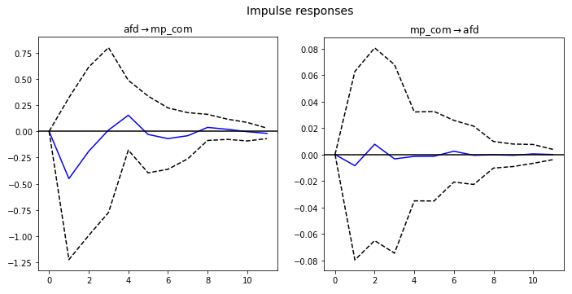

# To lead or to follow?
#### Mainstream parties’ issue emphasis and radical right success in Germany1.

### Short description:

The literature provides different expectations about the relationship between the emphasis of an issue through established parties, the vote share of the party 'owning' this issue (i.e. the party being associated with it), and the importance of an issue among the general public.

This project sets out to provide a new measure of parties' emphasis of the immigration issue. It does so by applying supervised machine learning techniques to press releases of German mainstream parties. Additionally, this data will be aggregated monthly and merged with data on public salience (from [Google Trends](https://trends.google.com/trends/?geo=DE)), and polling performance of the German radical right party AfD (from [PollOfPolls](https://www.politico.eu/europe-poll-of-polls/)). Lastly, the project will analyse these data using time-series regression, in order to disentangle the relationship between mainstream parties' issue emphasis of immigration, the issue's salience, and the AfD's vote share in the polls.

### Preliminary findings:
* Mainstream party communication on immigration is not affected by the vote share of the AfD in recent polls.
* The AfD vote share in current polls is not affected by mainstream parties' communication on immigration.
* The AfD vote share in current polls is unaffected by public salience of immigration.
* Public salience of immigration increases in response to mainstream parties' press releases on the topic.
* Public salience of immigration *decreases* the share of mainstream parties' press releases related to immigration.

### The following documents are available so far:

0.  A [short theoretical introduction](https://github.com/samunico/ImEm/blob/master/00_Introduction_and_analytical_strategy.pdf) to the project that formulates some hypotheses to be tested and describes the output to be produced.
1. The [code used to scrape the links](https://github.com/samunico/ImEm/blob/master/01_LinkScraper.py);
2. The [code used to scrape the actual press releases](https://github.com/samunico/ImEm/blob/master/02_ReleaseScraper.py).
3. The [code](https://github.com/samunico/ImEm/blob/master/03_Preprocessing.py) pre-processing the text.
4. A [notebook](https://nbviewer.jupyter.org/github/samunico/ImEm/blob/master/04_HandCoding.ipynb) showing how the training and test set for the classifier were coded.
5. A [notebook](https://nbviewer.jupyter.org/github/samunico/ImEm/blob/master/05_Classifier.ipynb) used to train the classifier.
6. A [notebook](https://nbviewer.jupyter.org/github/samunico/ImEm/blob/master/06_PrepareVariables.ipynb) preparing the variables for time-series estimation.
7. The [notebook](https://nbviewer.jupyter.org/github/samunico/ImEm/blob/master/07_TimeSeries.ipynb) analyzing the data to test the initially formulated hypotheses using time series estimation (VAR).
8. A [set of slides](https://nbviewer.jupyter.org/github/samunico/ImEm/blob/master/08_presentation.pdf) showcasing the preliminary results presented at the [Hot Politics Lab](http://www.hotpolitics.eu/) (University of Amsterdam).

### Additionally, the used and collected data are provided [here](https://www.dropbox.com/sh/87o5u709h97i4t1/AAAhTJsndUEdH4KJ9FPooF6la?dl=0):

* A dataset of AfD-polls from [PollOfPolls](https://www.politico.eu/europe-poll-of-polls/germany/).
* A dataset of monthly Google searches relating to immigration, taken from [Google Trends](https://trends.google.com/trends/explore?date=all&geo=DE&q=%2Fm%2F0cbx95).
* A dataset of the speeches including the coding
* A merged dataset of the aggregated monthly share of mainstream parties' press releases, merged with data on the [Google searches about immigration](https://trends.google.com/trends/explore?date=all&geo=DE&q=%2Fm%2F0cbx95), as well as the [the monthly polling of the AfD vote share, based on poll of polls](https://www.politico.eu/europe-poll-of-polls/germany/).
* A [folder](https://www.dropbox.com/sh/sr6nxeh6megg1w8/AABE0DEK9Kik77LLcUcHHjr0a?dl=0) with preliminary data used to construct the coded and aggregated datasets.

1: This project started out as the final project for Damian Trilling's [Big Data and Automated Content Analysis course](https://github.com/damian0604/bdaca).